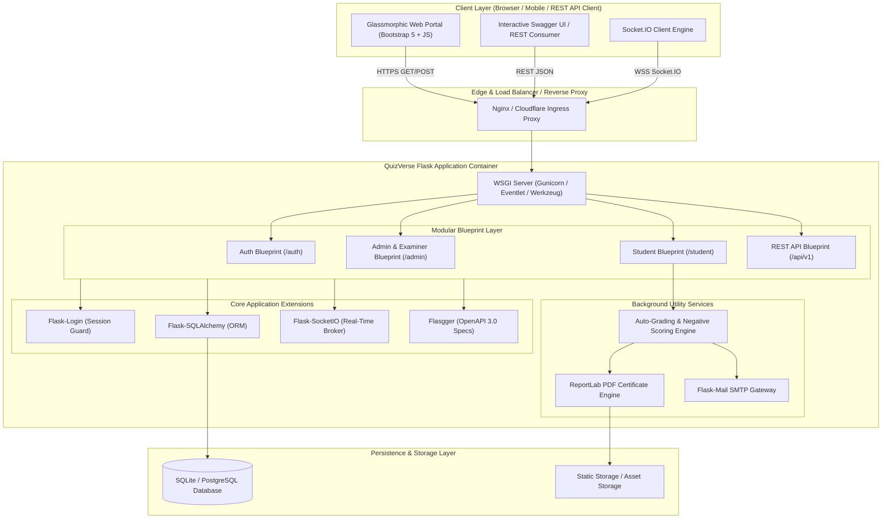
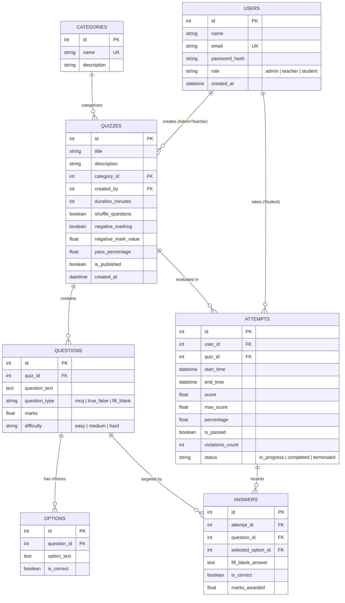
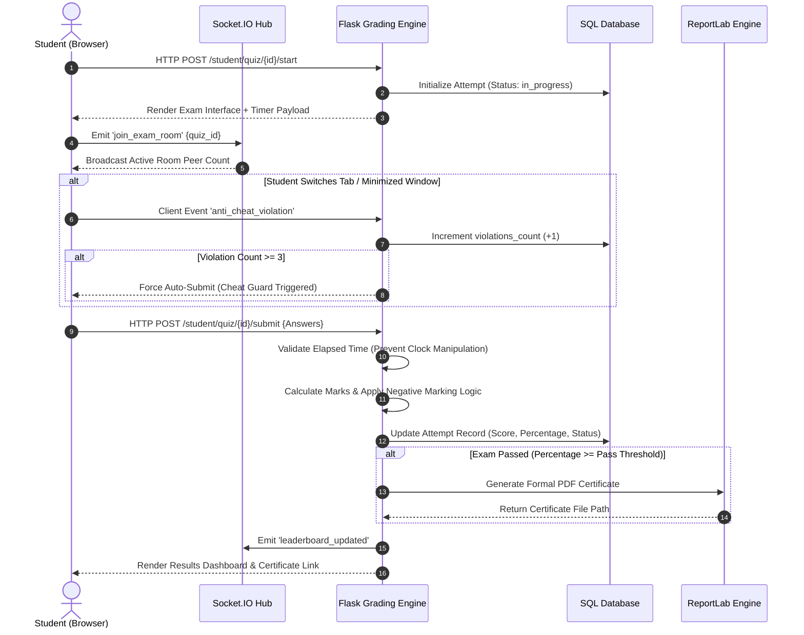

# 🚀 QuizVerse — Enterprise Online Quiz & Examination System
### *Pro DevOps & Software Engineering Edition*

[](https://github.com/HiteshTh/Online-Quiz-System/actions)
[](https://www.python.org/)
[](https://flask.palletsprojects.com/)
[](https://socket.io/)
[](https://www.docker.com/)
[](LICENSE)

QuizVerse is a production-grade, highly scalable, full-stack online examination and assessment platform. Designed with enterprise-grade **Role-Based Access Control (RBAC)**, real-time WebSocket synchronization, anti-cheating tab-switch detection, automated PDF certificate generation, and an interactive OpenAPI/Swagger REST engine.

Built for seamless containerization and cloud-native deployments, QuizVerse encapsulates modern software engineering practices, robust domain modeling, and continuous integration capabilities.

---

## 📋 Table of Contents

- [Architectural Topology](#-architectural-topology)
- [Database & Entity-Relationship Schema](#-database--entity-relationship-schema)
- [Real-Time Exam Engine & Anti-Cheat Flow](#-real-time-exam-engine--anti-cheat-flow)
- [CI/CD & DevOps Deployment Pipeline](#-cicd--devops-deployment-pipeline)
- [Key Feature Highlights](#-key-feature-highlights)
- [Technology Stack Matrix](#-technology-stack-matrix)
- [Folder & Repository Structure](#-folder--repository-structure)
- [Production DevOps Setup & Docker Guide](#-production-devops-setup--docker-guide)
- [Swagger REST API Reference](#-swagger-rest-api-reference)
- [Automated Testing & QA](#-automated-testing--qa)
- [Default Demo Credentials](#-default-demo-credentials)
- [License](#-license)

---

## 🏗️ Architectural Topology

The system adheres to an Application Factory Pattern, decoupling route blueprints, extensions, database models, and socket event dispatchers.



---

## 🗄️ Database & Entity-Relationship Schema

The data model enforces strict foreign key constraints, cascading deletion policies, user role validation, and real-time tracking of examination attempts.



---

## ⚡ Real-Time Exam Engine & Anti-Cheat Flow

To protect examination integrity, QuizVerse executes client-side tab switch monitoring combined with backend clock verification.



---

## 🔄 CI/CD & DevOps Deployment Pipeline

Our automated Continuous Integration and Continuous Deployment (CI/CD) pipeline ensures code hygiene, unit test execution, security scans, and container image construction on every push.

```mermaid
flowchart LR
    subgraph VCS ["Source Control"]
        GitCommit["git push / PR"]
    end

    subgraph GitHubActions ["GitHub Actions CI/CD Pipeline"]
        direction TB
        Checkout["1. Checkout Source Code"]
        SetupPy["2. Setup Python 3.11"]
        Deps["3. Install Dependencies"]
        Lint["4. Run Flake8 Code Audit"]
        Test["5. Execute PyTest with Coverage"]
        DockerBuild["6. Build & Verify Docker Image"]
    end

    subgraph DeploymentTarget ["Cloud / Production Infrastructure"]
        Registry["Container Registry (Docker Hub / GHCR)"]
        ServerDeploy["Production Container Deployment (Docker / K8s)"]
    end

    GitCommit --> Checkout
    Checkout --> SetupPy --> Deps --> Lint --> Test --> DockerBuild
    DockerBuild -->|On Merge to Main| Registry
    Registry --> ServerDeploy
```



---

## 💎 Key Feature Highlights

### 🛡️ 1. Role-Based Access Control (RBAC)
- **Granular Security Decorator:** Custom `@role_required(['admin', 'teacher'])` decorator guards administrative endpoints.
- **Isolated User Workspaces:** Dedicated layout templates and navigation workflows for Examiners vs Students.

### ⏱️ 2. Dynamic Exam Engine & Anti-Cheat Guard
- **Question Shuffling:** Randomizes question order per student attempt to prevent collusion.
- **Negative Marking Support:** Configurable deduction penalty per wrong answer (e.g., `-0.25`).
- **Tab-Switch Violation Counter:** Monitors `visibilitychange` events; auto-submits exam upon 3rd infraction.

### 📜 3. Automated PDF Certificate Construction
- Uses `ReportLab` to programmatically build landscape-formatted achievement certificates with student name, quiz score, issue date, and unique validation hashes.

### 📊 4. Real-Time Leaderboards & Room Counters
- Powered by `Flask-SocketIO` WebSockets. Shows real-time count of active test-takers and updates leaderboard positions dynamically.

### 🔌 5. Interactive Swagger REST API
- Exposes complete OpenAPI documentation at `/apidocs/` for seamless mobile app or third-party integration.

---

## 🛠️ Technology Stack Matrix

| Category | Technology | Usage Description |
|---|---|---|
| **Core Runtime** | Python 3.11+ | Primary execution environment |
| **Web Framework** | Flask 3.0.3 | Application factory, routing, blueprints |
| **Database ORM** | SQLAlchemy / Flask-SQLAlchemy | Schema management, relationships, transactional integrity |
| **Database Engine** | SQLite (Dev) / PostgreSQL (Prod) | Structured persistent data storage |
| **Real-Time Engine** | Flask-SocketIO (Socket.IO) | WebSockets event dispatcher |
| **Authentication** | Flask-Login + Werkzeug Security | Session cookies & PBKDF2 password hashing |
| **Document Generation** | ReportLab 4.2.2 | Dynamic PDF certificate compilation |
| **API Documentation** | Flasgger (OpenAPI 3.0) | Interactive Swagger UI engine |
| **Frontend UI** | Bootstrap 5 + Vanilla CSS Glassmorphism | Responsive dark-mode user interface |
| **Containerization** | Docker & Docker Compose | Multi-platform container runtime |
| **CI/CD Automation** | GitHub Actions | Automated build, linting, test, and image creation |

---

## 📦 Folder & Repository Structure

```
quiz_system/
├── .github/
│   └── workflows/
│       └── ci-cd.yml          # GitHub Actions CI/CD Pipeline
├── app/
│   ├── __init__.py            # Application Factory & /health route
│   ├── config.py              # Environment configurations (Dev, Test, Prod)
│   ├── extensions.py          # Flask extension instances (DB, Login, SocketIO, Mail)
│   ├── admin/                 # Blueprint: Examiner dashboard, Quiz & Question CRUD
│   ├── api/                   # Blueprint: OpenAPI Swagger REST endpoints
│   ├── auth/                  # Blueprint: Login, Register, Logout, RBAC
│   ├── models/                # SQLAlchemy Domain Models (User, Quiz, Question, Attempt)
│   ├── sockets/               # WebSockets event handlers
│   ├── static/                # CSS Glassmorphism stylesheets & JS engines
│   ├── student/               # Blueprint: Exam interface, grading, cert download
│   ├── templates/             # Jinja2 layouts & dark-mode views
│   └── utils/                 # Decorators, PDF builder, Mail dispatchers
├── instance/                  # SQLite runtime database container
├── tests/                     # Automated unittest / PyTest suites
├── .env.example               # Template for environment secret variables
├── .gitignore                 # Enterprise git exclusion rules
├── Dockerfile                 # Optimized Python Docker image definition
├── docker-compose.yml         # Container orchestration manifest
├── requirements.txt           # Python dependency manifest
├── run.py                     # Server entrypoint & database auto-seeder
└── README.md                  # Comprehensive DevOps documentation
```

---

## 🚀 Production DevOps Setup & Docker Guide

### 1. Quickstart with Local Virtual Environment

```bash
# Clone the repository
git clone https://github.com/HiteshTh/Online-Quiz-System.git
cd Online-Quiz-System

# Create and activate virtual environment
python -m venv venv

# Windows:
venv\Scripts\activate
# Linux/macOS:
source venv/bin/activate

# Install requirements
pip install -r requirements.txt

# Run server (Auto-initializes database & seeds default demo data)
python run.py
```
> Access app at: `http://127.0.0.1:5000`  
> Access Swagger API docs at: `http://127.0.0.1:5000/apidocs/`

---

### 2. Containerized Deployment with Docker & Docker Compose

```bash
# Build & Start Containerized Infrastructure
docker-compose up --build -d

# Check Container Status & Health
docker-compose ps

# View Real-time Application Logs
docker-compose logs -f web

# Stop Infrastructure
docker-compose down
```

---

### 3. Health & Observability Endpoint
The server exposes a health monitoring endpoint for Kubernetes Liveness/Readiness probes and Docker health checks:

```bash
curl -i http://localhost:5000/health
```
**Response (`200 OK`):**
```json
{
  "service": "QuizVerse",
  "status": "healthy",
  "version": "1.0.0"
}
```

---

## 🔑 Default Demo Credentials

The application automatically seeds initial administrator and student test accounts on first boot:

| Account Type | Email | Password | Role / Permissions |
|---|---|---|---|
| **Admin / Examiner** | `admin@quizverse.com` | `admin123` | Full access to quiz creation, question banks, CSV import |
| **Student** | `student@quizverse.com` | `student123` | Exam access, timer, real-time leaderboard, certificates |

---

## 🧪 Automated Testing & QA

Run the full test suite verifying authorization guards, quiz grading, and negative score calculation:

```bash
# Run tests using built-in unittest
python -m unittest discover tests

# Or run using PyTest with Coverage report
pytest --cov=app tests/
```

---

## 📜 License

This project is open-source software licensed under the [MIT License](LICENSE).

---
*Maintained with ❤️ by [HiteshTh](https://github.com/HiteshTh)*
